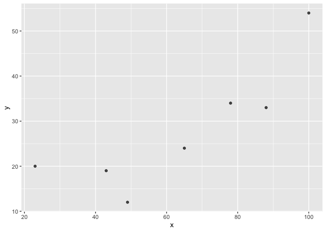

<!-- README.md is generated from README.Rmd. Please edit that file -->

# graphre

<!-- badges: start -->
<!-- badges: end -->

The goal of graphre is to creates a scatterplot to demonstrate the
relationship between two numeric variables.

## Installation

You can install the development version of graphre from
[GitHub](https://github.com/) with:

``` r
install_github("stat545ubc-2024/assignment-b2-zhichun-qi/graphre",ref="0.1.0")
```

## Example

This is a basic example which shows you how to solve a common problem:

``` r
library(graphre)
#Create a scatterplot for two variables x and y
x <- c(43,23,78,100,88,65,49)
y <- c(19,20,34,54,33,24,12)
graph_relation(x,y)
```



You’ll still need to render `README.Rmd` regularly, to keep `README.md`
up-to-date. `devtools::build_readme()` is handy for this.
